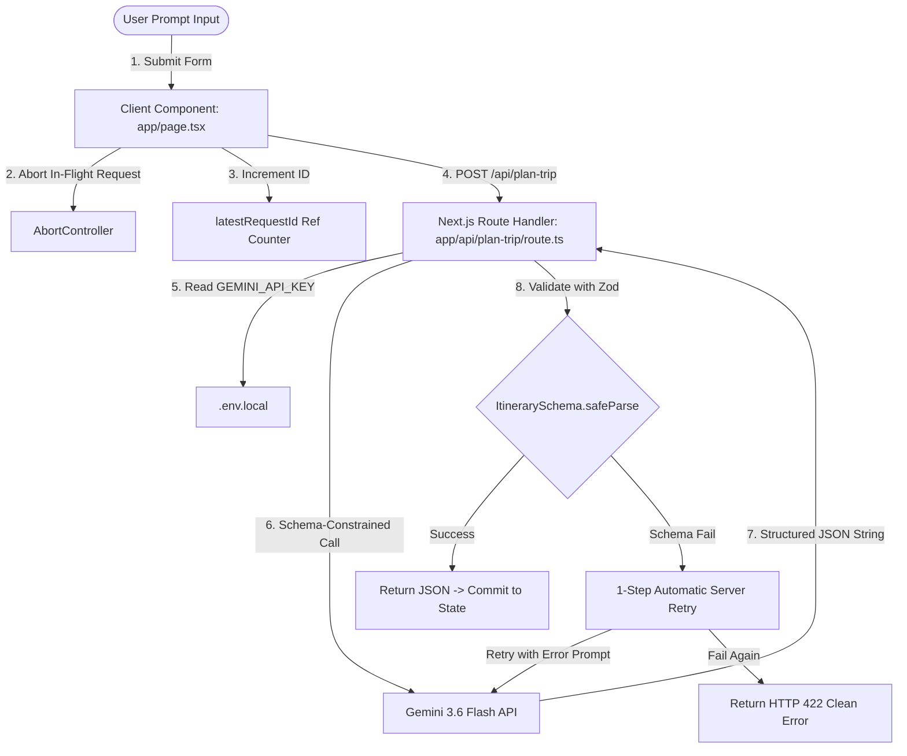

# 🧠 Wayfarer AI - 15-Minute Technical Interview Prep Guide

> **Quick Reading Time**: ~15 minutes  
> Use this guide right before your live assignment interview to confidently defend every decision, explain race-condition protection, and answer technical questions on the spot.

---

## 🎯 1. Elevator Pitch & Core Product Identity

> *"Wayfarer AI is a production-quality React/Next.js travel application that converts free-form trip prompts into structured, interactive day-by-day itineraries. Unlike chatbots that output unstructured markdown text, Wayfarer enforces server-side structured JSON output from Gemini 3.6 Flash, validates it with Zod schemas, guards against client-side race conditions with AbortControllers, and allows users to reorder, edit, copy, and export their trip."*

### Why is this NOT a chatbot?
- **No conversation logs or message bubbles**: Chatbot interfaces force users to prompt repeatedly and copy-paste text.
- **Form-in, Interactive App out**: Users specify structured inputs (prompt, duration, budget, pace, interests), and receive a rich, editable dashboard UI with drag/move controls, timeline connectors, and export buttons.

---

## 🏗️ 2. High-Level Architecture & Data Flow



### Component Hierarchy
```
Home (app/page.tsx) [State Machine Owner]
├── Header (components/Header.tsx) [Live AI Status & Pulsing Dot]
├── TripForm (components/TripForm.tsx) [Hero, Form Inputs, Destination Presets]
├── EmptyState (components/EmptyState.tsx) [Sample Itinerary Preview]
├── LoadingState (components/LoadingState.tsx) [Animated Workflow & 500ms Success Badge]
├── ErrorState (components/ErrorState.tsx) [Illustrated Error Card + Retry Trigger]
├── ItineraryView (components/ItineraryView.tsx) [Dashboard Summary, Export Tools, Recs]
│   └── DayCard (components/DayCard.tsx) [Timeline Connectors, Day Accordion]
│       └── StopCard (components/StopCard.tsx) [Move Up/Down, Remove, Tips, Photo Spot]
├── Footer (components/Footer.tsx) [Tech Stack Badges]
└── ToastContainer (components/ToastContainer.tsx) [Non-blocking Toast Overlays]
```

---

## 🔐 3. Security & Technology Decisions

| Technology | Why Chosen? | Interview Talking Point |
|---|---|---|
| **Next.js (App Router)** | Full-stack serverless capabilities in a single repo. | *"Next.js Route Handlers act as a secure proxy between client and Gemini, avoiding the need for a separate backend server."* |
| **Route Handler (`route.ts`)** | Runs strictly on the server (`Node.js` environment). | *"Placing API calls in `route.ts` ensures `process.env.GEMINI_API_KEY` never leaks into browser client JavaScript bundles."* |
| **Gemini 3.6 Flash** | Native structured JSON support via `responseSchema` & `responseMimeType: "application/json"`. | *"Gemini natively constrains model output to our exact JSON schema at the LLM level, drastically reducing hallucination risks."* |
| **Zod Schema Validation** | Runtime validation of parsed JSON objects. | *"Even with model constraints, LLMs can rarely omit fields. Zod gives us defense-in-depth before data touches React UI."* |

---

## 🛡️ 4. Race-Condition Guarding (Most Tested Section)

### The Problem
If a user submits **Prompt A** (takes 8 seconds) and immediately submits **Prompt B** (takes 2 seconds), Prompt B will complete first. Without protection, Prompt A resolves 6 seconds later and **overwrites Prompt B's fresh result with Prompt A's stale itinerary!**

### The Double-Layered Solution (`app/page.tsx`)

1. **Layer 1: `AbortController` (`abortControllerRef.current`)**
   ```ts
   if (abortControllerRef.current) {
     abortControllerRef.current.abort(); // Immediately cancels the HTTP socket of the previous request
   }
   const controller = new AbortController();
   abortControllerRef.current = controller;
   ```

2. **Layer 2: `latestRequestId` Ref Counter (`latestRequestId.current`)**
   ```ts
   const currentRequestId = ++latestRequestId.current;
   // ... after fetch resolves ...
   if (currentRequestId !== latestRequestId.current) {
     return; // Silently drop stale response if a newer request was dispatched
   }
   ```

3. **Client 20-Second Timeout Guard**:
   ```ts
   const timeoutId = setTimeout(() => {
     if (latestRequestId.current === currentRequestId) {
       controller.abort(); // Cancel hanging network requests after 20s
     }
   }, 20000);
   ```

---

## 🔄 5. Server-Side Retry Logic (`app/api/plan-trip/route.ts`)

```ts
// 1. Initial attempt
let validationResult = ItinerarySchema.safeParse(parsedJson);

// 2. Automatic 1-step retry if Zod validation fails
if (!validationResult || !validationResult.success) {
  const errorDetails = validationResult.error.issues.map(i => `${i.path.join(".")}: ${i.message}`).join("; ");
  const retryPrompt = buildSystemPrompt(body, errorDetails);
  
  // Retry Gemini with lower temperature (0.2) and explicit error correction prompt
  const retryResponse = await ai.models.generateContent({ ... });
  parsedJson = JSON.parse(retryResponse.text);
  validationResult = ItinerarySchema.safeParse(parsedJson);
}

// 3. Final check: Return clean HTTP 422 if retry fails
if (!validationResult.success) {
  return NextResponse.json({ error: "Invalid itinerary structure after retry." }, { status: 422 });
}
```

---

## ❓ 6. Common Interview Questions & Ideal Answers

### Q1: "Why did you use Move Up / Move Down buttons instead of Drag and Drop?"
> **Ideal Answer**:  
> *"Drag-and-drop libraries (like `react-beautiful-dnd` or `dnd-kit`) are notoriously fragile on mobile viewports (375px–430px) because touch gestures conflict with vertical page scrolling. Deterministic Move Up/Down buttons provide 100% reliable, accessible (`aria-label`, keyboard navigable) array reordering that works flawlessly on every device without heavy external library dependencies."*

### Q2: "How do you handle state updates when a stop is removed or reordered?"
> **Ideal Answer**:  
> *"State updates are completely immutable. When a stop is moved or deleted, `DayCard` creates a shallow copy of the day's stops array (`[...stops]`), performs the swap or filter, and bubbles the updated array up to `ItineraryView` via `setItinerary`. This triggers clean, predictable React re-renders."*

### Q3: "What happens if Gemini returns unparseable JSON?"
> **Ideal Answer**:  
> *"We catch `JSON.parse` exceptions server-side in `route.ts`. If parsing fails or Zod validation fails, our server automatically retries Gemini once with an error-correction prompt. If it fails a second time, the server returns an HTTP 422 error, which the client catches and displays as an `ErrorState` card with a Retry button. The UI never crashes."*

### Q4: "How is keyboard navigation supported?"
> **Ideal Answer**:  
> *"Users can press `Ctrl + Enter` (or `Cmd + Enter`) anywhere in the form to generate an itinerary, `Esc` to blur inputs, and `Tab` to navigate all interactive buttons. Accordions support `onKeyDown` for `Enter` and `Space` keys."*

---

## 🔮 7. Future Improvements & Known Limitations

1. **Cross-Day Reordering**: Dragging a stop from Day 1 to Day 2 (currently stops are reordered within their assigned day).
2. **Interactive Map Coordinates**: Integrating Google Maps or Mapbox pinpoints using stop locations.
3. **User Authentication & Persistence**: Saving created itineraries to a PostgreSQL / Supabase database.
